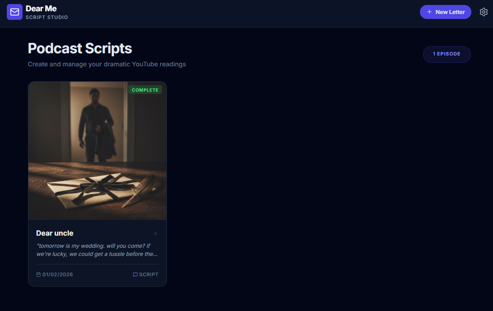
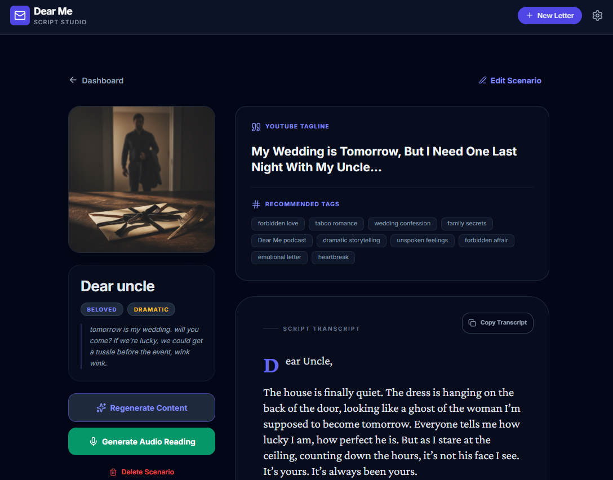

# Dear Me — Letter Script Studio

**Dear Me** is a specialized production studio designed for YouTube creators and podcasters who specialize in dramatic readings of letters. This application leverages the power of Google Gemini AI to transform simple letter prompts into full-production packages including evocative scripts, cinematic cover art, and emotional voice readings.

## ✨ Features




- **Dramatic Scripting**: Uses Gemini 3 Pro to craft deeply emotional and evocative letters starting with "Dear...", tailored to specific relationships and tones.
- **Cinematic Cover Art**: Generates professional, text-less podcast cover art using Gemini 2.5 Flash Image models.
- **AI Voice Synthesis**: Synthesizes dramatic audio readings of generated scripts using Gemini 2.5 Flash TTS (Text-to-Speech).
- **YouTube Metadata**: Automatically generates catchy episode taglines and relevant SEO tags for YouTube optimization.
- **Scenario Management**: Define recipients, relationships (beloved, hated, secret, etc.), and tones (humorous, melancholic, angry) to guide the AI.
- **Local Studio**: All episodes and scripts are stored locally in your browser, ensuring your creative work is saved between sessions.
- **Custom UI**: A premium dark-mode experience built with React and Tailwind CSS, featuring custom toast notifications and confirmation modals.

## 🚀 Tech Stack

- **Frontend**: React 19, Tailwind CSS.
- **Icons**: Lucide React.
- **AI Engine**: Google Gemini API (`@google/genai`).
  - `gemini-3-pro-preview` for complex text reasoning and scripting.
  - `gemini-2.5-flash-image` for high-quality artistic generation.
  - `gemini-2.5-flash-preview-tts` for emotional audio synthesis.

## 🛠️ Configuration

The application requires a Google Gemini API Key. In the development environment, ensure the `API_KEY` is provided via the environment variables.

```json
{
  "API_KEY": "your_gemini_api_key_here"
}
```

## 📖 Usage

1. **Create a Scenario**: Click "New Letter" and define who the letter is for, your relationship with them, the emotional tone, and a brief topic description.
2. **Generate Package**: Click "Generate Full Episode" to create the script, cover art, tagline, and tags simultaneously.
3. **Synthesize Audio**: Once the script is ready, click "Generate Audio Reading" to hear the dramatic interpretation.
4. **Refine**: Use the "Edit Scenario" feature to tweak the input and regenerate if the emotional beats need adjustment.
5. **Publish**: Copy the transcript and metadata directly into your YouTube studio.

## 🛡️ Privacy

All generated scripts and settings are saved to your browser's `localStorage`. No data is stored on a centralized server other than the prompts sent to the Gemini API for generation.
